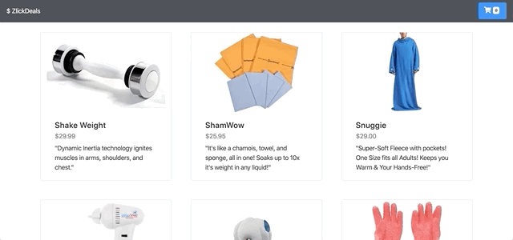

# zlickDeals

zlickDeals is a full stack LAMP based shopping cart simulation built in React and PHP.

### Live Demo
Try the application live at http://zlickdeals.ziyaadcodes.com/

### Technologies Used

  - React.js
  - PHP
  - Bootstrap 4
  - Webpack 4
  - HTML5
  - AWS EC2

### Features
- User can view a list of all products
- User can view details of all products
- User can add products to their cart
- User can access both the cart and checkout pages
- User can enter their purchase information

### Preview


### Development

#### System Requirements 
- [Node.js](https://nodejs.org/) v10+ to run.
- [NPM](https://www.npmjs.com/) v6+ to run.

#### Getting Started
Clone the Repository
```sh
$ git clone https://github.com/ziyaadm/zlickDeals.git
$ cd zlickDeals
```

Install all dependencies with NPM

```sh
$ npm install
```

Start the project
```sh
$ npm run dev
view the application by opening http://localhost:3000 in the browser
```
